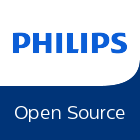

# Open Source at Philips

1. [Purpose](#purpose)
1. [Motivation](#motivation)
1. [Contact](#contact)

## 1. Purpose
This document has been created by the Philips [Open Source Team](#contact) and publicly describes Philips policy on open sourcing (publishing).

Philips employees: please read the [internal version](https://github.com/philips-internal/open-source), which contains additional instructions and a few internal links.

## 2. Motivation
Open source software and the principles of the open source software development model are well in line with the Philips Accelerate program. Using and contributing to open source software provides an opportunity for Philips to delight our customers by reducing time to market and product development costs. 

### 2.1 Publication via github
For now, open source projects release by and maintained by Philips will be available via this github account.

### 2.2 License
Unless stated otherwise, Philips contributions are licensed under the [MIT License](https://spdx.org/licenses/MIT.html).

## 3. Contact
Each project lists the maintainer(s) - they are the prime contacts for the project. For any other queries, please contact the Philips Open Source Team:
- [Bart Golsteijn](https://github.com/bartgolsteijn/)
- [Scott Guymer](https://github.com/scottguymer)
- [Ron Jaegers](https://github.com/rjaegers)
- [Arnold Niessen](https://github.com/ArnoldNiessen)
- [Niek Palm](https://github.com/npalm)
- [David Terol](https://github.com/dterol23)
